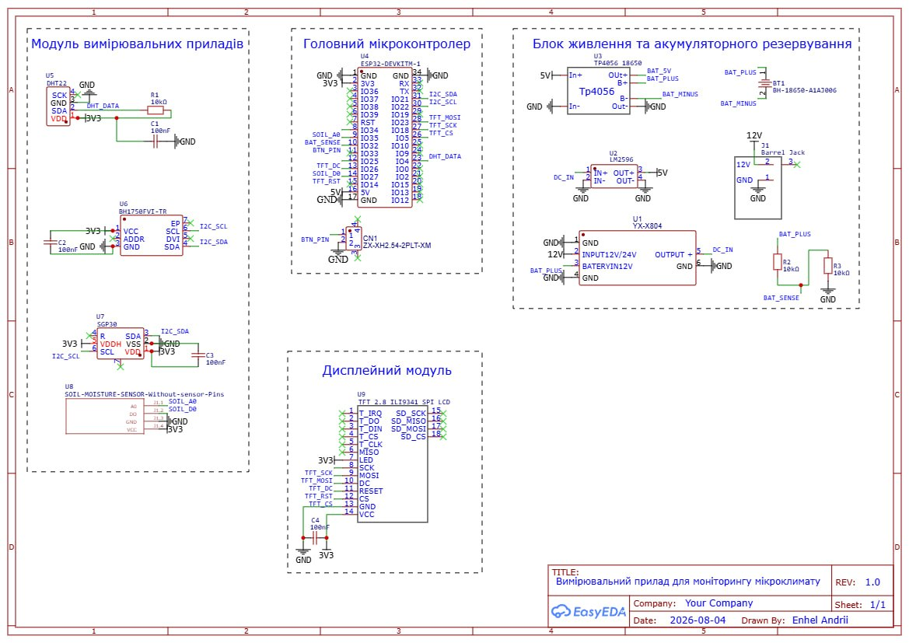

# Greenhouse IMS + ML

**Скільки точності прогнозування втрачає система через дешеві датчики — і який
саме з них винен.**

Дослідницький проєкт про інформаційно-вимірювальну систему моніторингу
мікроклімату теплиці: модель похибок вимірювальних каналів, прогнозування
методами машинного навчання і кількісна оцінка того, як одне впливає на інше.

---

## Головний результат

Деградація точності виявилася **вкрай нерівномірною**. Систему обмежує
**один канал**, а не бюджетні датчики загалом.

| Канал | Датчик | Зростання похибки прогнозу | Висновок |
|---|---|:--:|---|
| Температура повітря | DHT22 | ×1,13 | придатний |
| Вологість повітря | DHT22 | ×1,45 | придатний |
| Освітленість | BH1750 | — | придатний після калібрування |
| Вологість субстрату | ємнісний + АЦП | — | не бере участі в прогнозі |
| **Концентрація CO₂** | **SGP30** | **×5,09** | **непридатний** |

Більше того: якщо **прибрати** канал CO₂ з набору ознак, прогноз концентрації
CO₂ **покращується на 15,6 %**. Канал не просто неточний — він гірший за свою
відсутність.

> Заміна одного датчика CO₂ дає більше, ніж модернізація всіх інших каналів
> разом узятих.

---

## Прилад



ESP32-DevKitM-1 та чотири вимірювальні канали:

| Позначення | Датчик | Вимірювана величина | Інтерфейс |
|---|---|---|---|
| U5 | DHT22 (AM2302) | температура і відносна вологість повітря | 1-Wire |
| U6 | BH1750FVI | освітленість | I²C |
| U7 | SGP30 | еквівалентна концентрація CO₂ | I²C |
| U8 | ємнісний датчик вологості ґрунту | вологість субстрату | АЦП ESP32 |

Живлення: 12 В через понижувальні перетворювачі LM2596 і YX-X804, резервування
акумулятором 18650 з контролером заряду TP4056. Відображення — TFT 2.8" на
контролері ILI9341 через SPI.

---

## Як це досліджувалося без готового приладу

Приладу ще немає в металі, власних вимірювань немає. Замість того щоб це
приховувати, проблему перетворено на предмет дослідження.

```
Відкритий набір даних промислової теплиці   →  істинне значення (еталон)
              ↓
   Модель похибки нашого вимірювального каналу
   (шум, зміщення, дрейф, квантування, інерційність,
    перехресна чутливість, методична похибка, відмови)
              ↓
        Показання, які дав би наш прилад
              ↓
   Навчання моделі прогнозу на спотворених даних
              ↓
   Оцінка точності за ІСТИННИМИ значеннями
```

Різниця між прогнозом за «чистими» і за «спотвореними» даними — це і є ціна
бюджетних датчиків, виражена в числах.

**Джерело еталонних даних:** Autonomous Greenhouse Challenge, 2-ге видання
(Wageningen University & Research). Шість відсіків теплиці, черрі-помідор,
грудень 2019 — травень 2020, крок 5 хвилин.
DOI [10.4121/uuid:88d22c60-21b3-4ea8-90db-20249a5be2a7](https://doi.org/10.4121/uuid:88d22c60-21b3-4ea8-90db-20249a5be2a7),
ліцензія CC0. Після чистки — суцільна ділянка 61 доба (17 617 відліків).

---

## Швидкий старт

```bash
python3 -m venv .venv
.venv/bin/pip install -r requirements.txt
```

На macOS для `xgboost` додатково потрібен OpenMP: `brew install libomp`.

Підготовка даних і базовий аналіз (менше хвилини):

```bash
.venv/bin/python scripts/download_data.py   # завантажити набір даних, 8.4 МБ
.venv/bin/python scripts/prepare_data.py    # почистити і зберегти опорний ряд
.venv/bin/python scripts/demo.py            # аналіз придатності каналів
```

Усе дослідження однією командою (**близько години** — навчається кілька сотень
моделей):

```bash
.venv/bin/python run_all.py
```

Окремі досліди:

```bash
.venv/bin/python scripts/exp01_baseline.py         # E1   ~10 хв
.venv/bin/python scripts/exp02_co2_sensor.py       # E2-CO2  ~5 хв
.venv/bin/python scripts/exp03_noise_level.py      # E2   ~15 хв
.venv/bin/python scripts/exp04_error_components.py # E3   ~20 хв
.venv/bin/python scripts/exp05_fusion.py           # E4   ~15 хв
.venv/bin/python scripts/exp06_compensation.py     # E5   ~10 хв
.venv/bin/python scripts/exp07_fault_detection.py  # E6   ~10 хв
.venv/bin/python scripts/exp08_esp32_footprint.py  # E7    ~2 хв
```

---

## Досліди і що вони показали

### E1. Яка точність узагалі досяжна

Найкраща модель — випадковий ліс. Виграш над наївним прогнозом «величина не
зміниться» зростає з горизонтом: **33 %** на 15 хвилинах і **62 %** на годині.
Значущість підтверджена тестом Діболда — Маріано.

Нейромережа GRU програла ансамблям дерев — типово для 12 тисяч навчальних
записів.

### E2-CO2. Чи залежить висновок про SGP30 від припущень

Коефіцієнт гіпотези змінювався від 0,1 до 1,0. Навіть за найсприятливішого
припущення відношення сигнал/похибка не перевищує **0,94** — канал лишається
за порогом непридатності. Висновок не залежить від спірного припущення: канал
губить паспортна похибка 15 % від значення за розмаху сигналу всього 57 ppm.

| Датчик | Принцип | RMSE прогнозу CO₂ |
|---|---|:--:|
| ідеальний канал (межа) | — | 33 ppm |
| **SCD30** | NDIR | **35 ppm** |
| MH-Z19B | NDIR | 43 ppm |
| SGP30 | MOX (обчислює eCO₂) | 165 ppm |

### E2. Скільки точності з'їдає похибка каналів

| Рівень похибки | T повітря | RH повітря | CO₂ |
|---|:--:|:--:|:--:|
| 0 — ідеальні вимірювання | ×1,00 | ×1,00 | ×1,00 |
| **1 — паспортна** | **×1,13** | **×1,45** | **×5,09** |
| 3 — сильно деградовані | ×1,57 | ×3,05 | ×15,63 |
| 5 — передаварійний стан | ×2,05 | ×4,94 | ×27,11 |

### E3. Яка складова похибки винна

| Канал | Головне джерело | Частка | Чим усувається |
|---|---|:--:|---|
| T повітря | дрейф у часі | 95,9 % | повірка (але деградація мізерна) |
| RH повітря | систематичне зміщення | 46,0 % | калібрування за еталоном |
| CO₂ | дрейф нульової лінії | 44,9 % | формально повірка, фактично ніяк |

Останній рядок потребує пояснення. Штатне самокалібрування MOX-датчика бере за
нуль мінімальну концентрацію за добу, вважаючи, що приміщення провітрюється до
вуличних ~400 ppm. У теплиці з дозуванням CO₂ такого не буває ніколи — опорної
точки немає, і «повірка» нездійсненна.

### E4. Чи окупається кожен датчик

Зростання похибки при виключенні каналу з набору ознак:

| Виключено | Прогноз T | Прогноз RH | Прогноз CO₂ |
|---|:--:|:--:|:--:|
| T повітря | **+60,9 %** | +0,6 % | +0,6 % |
| RH повітря | +3,4 % | **+8,9 %** | +1,1 % |
| Освітленість | +14,4 % | −2,0 % | +0,7 % |
| Вологість субстрату | −0,0 % | −2,6 % | +0,8 % |
| CO₂ | −1,3 % | +1,4 % | **−15,6 %** |

Окреме спостереження: для температури додавання сусідніх каналів спочатку
**погіршує** прогноз, і лише дані про стани виконавчих механізмів (опалення,
кватирки, завіси, досвічування) виводять його в плюс. Моделі цінні не стільки
вимірювання сусідніх величин, скільки відомості про **причини** зміни клімату.

### E5. Чи можна повернути точність програмно

Частка відіграних втрат (100 % = рівень ідеальних вимірювань):

| Спосіб | T повітря | RH повітря | CO₂ |
|---|:--:|:--:|:--:|
| медіанний фільтр | −70 % | −8 % | 0 % |
| експоненційне згладжування | 45 % | 8 % | −2 % |
| **калібрування за еталоном** | 76 % | **101 %** | **78 %** |
| навчання з аугментацією | **86 %** | 3 % | −12 % |

Фільтрація не рятує і часто шкодить: похибки бюджетних датчиків переважно
систематичні, а фільтр бореться з випадковим шумом і додає запізнення.

Найпереконливіший аргумент за заміну датчика: калібрування знижує похибку CO₂
зі 165 до 61 ppm, а SCD30 **без жодного калібрування** дає 35 ppm.

### E6. Чи помітить система, що датчик зламався

Метод — аналітична надмірність: канал оцінюється за іншими каналами, погодою і
станами механізмів, але **не за власною історією** (залиплий датчик чудово
передбачає сам себе). Пороги підібрані під одну хибну тривогу на добу.

| Вид відмови | Виявлено | Затримка |
|---|:--:|:--:|
| **сповзання показань** | **100 %** | 50–265 хв |
| одиничні викиди | 68,5 % | 24 хв |
| залипання значення | 24,1 % | 75 хв |
| обрив каналу | 24,1 % | 75 хв |

Обрив і залипання дають однакові цифри не випадково: драйвер при невдалому
читанні повертає останнє вдале значення, і після такої підстановки це
буквально один і той самий сигнал. **Вимога до прошивки:** позначати пропущені
відліки явно, а не підставляти попередній.

### E7. Чи вміститься модель у мікроконтролер

| Модель | RMSE | Пам'ять (int8) | В ОЗП 160 КБ |
|---|:--:|:--:|:--:|
| Ridge | 0,87 | 0,1 КБ | так |
| **GRU** | 0,79 | **26 КБ** | **так** |
| градієнтний бустинг | 0,64 | 169 КБ | ні |
| випадковий ліс | **0,58** | 2050 КБ | ні |

Вибір моделі для приладу не збігається з вибором за точністю. Програш
нейромережі в точності на третину оплачується виграшем у пам'яті **у 78 разів**.
Швидкодія не обмежує: 7,3 мс при опитуванні раз на 5 хвилин.

---

## Документація

**[notebooks/demo.ipynb](notebooks/demo.ipynb)** — виконуваний звіт: увесь хід
роботи з кодом, таблицями і рисунками, 50 комірок. GitHub показує його прямо в
браузері разом із результатами обчислень.

Числові результати всіх дослідів лежать у [`results/tables/`](results/tables)
(13 таблиць у форматі CSV), рисунки — у [`results/figures/`](results/figures)
(11 файлів). І те, і те відтворюється командою `run_all.py`.

---

## Джерела

### Дані

- **Hemming S., de Zwart F., Elings A., Petropoulou A., Righini I.** Autonomous
  Greenhouse Challenge, Second Edition (2019). 4TU.ResearchData, 2020.
  DOI: [10.4121/uuid:88d22c60-21b3-4ea8-90db-20249a5be2a7](https://doi.org/10.4121/uuid:88d22c60-21b3-4ea8-90db-20249a5be2a7) ·
  [сторінка набору](https://data.4tu.nl/articles/_/12764777/2) ·
  [опис змагання](https://www.wur.nl/en/research/plant/autonomous-greenhouse-challenge)
  <br>Джерело опорних («істинних») даних. Шість відсіків теплиці, черрі-помідор,
  крок 5 хвилин, ліцензія CC0.

### Метрологія та оцінювання похибок

- **JCGM 100:2008.** Evaluation of measurement data — Guide to the expression of
  uncertainty in measurement (GUM). BIPM.
  [PDF](https://www.bipm.org/documents/20126/2071204/JCGM_100_2008_E.pdf) ·
  DOI: [10.59161/JCGM100-2008E](https://doi.org/10.59161/JCGM100-2008E)
  <br>Базовий документ із подання невизначеності. Обґрунтовує спосіб складання
  похибок від різних джерел, який використано в `gims/sensors.py`, і трактування
  паспортної межі як рівномірного закону (СКВ = межа/√3).

- **ДСТУ 2708:2006.** Метрологія. Повірка засобів вимірювальної техніки.
  Організація та порядок проведення.
  [опис стандарту](https://online.budstandart.com/ua/catalog/doc-page.html?id_doc=110983)
  <br>Український нормативний документ щодо повірки. Потрібен, коли йдеться про
  регламент обслуговування каналів і про різницю між калібруванням і повіркою.

### Характеристики бюджетних датчиків

- **Wardani I. K. та ін.** The feasibility study: Accuracy and precision of DHT22
  in measuring the temperature and humidity in the greenhouse. *IOP Conference
  Series: Earth and Environmental Science*, 2023, vol. 1230, 012146.
  DOI: [10.1088/1755-1315/1230/1/012146](https://doi.org/10.1088/1755-1315/1230/1/012146)
  <br>Незалежна перевірка DHT22 саме в теплиці: RMSE 1,48 °C і 3,18 %RH проти
  еталонного приладу. Підтверджує порядок величин, прийнятий у нашій моделі каналу.

- **Collier-Oxandale A. M., Thorson J., Halliday H., Milford J., Hannigan M.**
  Understanding the ability of low-cost MOx sensors to quantify ambient VOCs.
  *Atmospheric Measurement Techniques*, 2019, vol. 12(3), pp. 1441–1460.
  DOI: [10.5194/amt-12-1441-2019](https://doi.org/10.5194/amt-12-1441-2019)
  <br>**Ключове джерело для висновку про SGP30.** Показано, що в металооксидних
  датчиків температура і вологість часто пояснюють більшу частку дисперсії
  сигналу, ніж власне цільова речовина, а моделі калібрування перенавчаються під
  місце, де їх навчали. Це саме те, що ми моделюємо перехресною чутливістю і
  методичною похибкою.

- **Dubey R., Telles A., Nikkel J., Cao C., Gewirtzman J., Raymond P. A., Lee X.**
  Low-Cost CO₂ NDIR Sensors: Performance Evaluation and Calibration Using Machine
  Learning Techniques. *Sensors*, 2024, vol. 24(17), 5675.
  DOI: [10.3390/s24175675](https://doi.org/10.3390/s24175675) ·
  [повний текст (PMC)](https://pmc.ncbi.nlm.nih.gov/articles/PMC11397870/)
  <br>Оцінка бюджетних NDIR-датчиків CO₂ і межі машинного калібрування. Автори
  окремо відзначають, що моделі, навчені в камері, погіршували показники в
  польових умовах — це прямо перегукується з нашим висновком E5 про те, що
  програмна компенсація не замінює вибору адекватного датчика.

### Прогнозування мікроклімату теплиці

- **Jung D.-H., Kim H.-S., Jhin C., Kim H.-J., Park S. H.** Time-serial analysis
  of deep neural network models for prediction of climatic conditions inside a
  greenhouse. *Computers and Electronics in Agriculture*, 2020, vol. 173, 105402.
  DOI: [10.1016/j.compag.2020.105402](https://doi.org/10.1016/j.compag.2020.105402)
  <br>Порівняння ANN, NARX і LSTM для прогнозу температури, вологості та CO₂ на
  5–30 хвилин. Дає зовнішню точку відліку для наших результатів E1 і показує ту
  саму закономірність: точність спадає зі зростанням горизонту.

### Методи оцінювання результатів

- **Diebold F. X., Mariano R. S.** Comparing Predictive Accuracy. *Journal of
  Business & Economic Statistics*, 1995, vol. 13(3), pp. 253–263.
  DOI: [10.1080/07350015.1995.10524599](https://doi.org/10.1080/07350015.1995.10524599) ·
  [PDF](https://users.ssc.wisc.edu/~behansen/718/DieboldMariano1995.pdf)
  <br>Першоджерело тесту, реалізованого в `gims/metrics.py`. Потрібен, бо похибки
  прогнозу сусідніх моментів часу корельовані і звичайний t-тест завищив би
  значущість.

### Обчислення на мікроконтролерах

- **Banbury C. та ін.** MLPerf Tiny Benchmark. *Proceedings of the NeurIPS Track
  on Datasets and Benchmarks*, 2021. arXiv:
  [2106.07597](https://arxiv.org/abs/2106.07597) ·
  [репозиторій](https://github.com/mlcommons/tiny)
  <br>Галузевий орієнтир для оцінки моделей на пристроях класу ESP32 (10–250 МГц,
  менше 50 мВт). Корисний як зовнішня рамка для дослідy E7 і як приклад того,
  що вимірюють на реальних платах, а не розрахунком.

### Українські видання за темою

- **Свістельник О. С., Чепюк Л. О.** Теоретичні основи побудови мікропроцесорної
  інформаційно-вимірювальної системи контролю параметрів мікроклімату на
  поліграфічному виробництві. *Технічна інженерія*, 2026, № 1(97), с. 397–402.
  DOI: [10.26642/ten-2026-1(97)-397-402](https://doi.org/10.26642/ten-2026-1(97)-397-402) ·
  [стаття](https://ten.ztu.edu.ua/article/view/360669)


Профільні українські фахові видання категорії Б:

- [**Вимірювальна техніка та метрологія**](https://science.lpnu.ua/uk/istcmtm) —
  Національний університет «Львівська політехніка», видається з 1965 року,
  повнотекстовий відкритий доступ.
- [**Технічна інженерія**](https://ten.ztu.edu.ua/) — Державний університет
  «Житомирська політехніка».
- [**Вимірювальна та обчислювальна техніка в технологічних процесах**](https://vottp.khmnu.edu.ua/) —
  Хмельницький національний університет.

> Усі посилання перевірені: кожне джерело відкрито, назву, авторів, рік і DOI
> звірено з першоджерелом.

---

## Структура проєкту

```
gims/                    ядро: моделі похибок і конвеєр прогнозування
  config.py              шляхи, канали, горизонти, параметри дослідів
  sensors.py             моделі похибок вимірювальних каналів  ← серце проєкту
  datasets.py            завантаження AGC, чистка, перевірка фізичних меж
  features.py            ознаки, хронологічний поділ вибірок
  models.py              наївний прогноз, Ridge, ліс, бустинг, GRU
  metrics.py             RMSE/MAE/R², виграш над наївним, тест Діболда — Маріано
  faults.py              внесення розмічених відмов каналу

scripts/                 підготовка даних і досліди
  download_data.py       завантаження набору даних із 4TU
  prepare_data.py        підготовка опорного ряду
  demo.py                аналіз придатності каналів
  exp01…exp08            досліди E1–E7

notebooks/demo.ipynb     виконуваний звіт із кодом і результатами
data/raw/                сирий архів AGC (завантажується скриптом)
data/processed/          готовий опорний ряд (parquet)
results/figures/         рисунки, 11 файлів
results/tables/          таблиці, 13 файлів (csv)
docs/schematic.jpg       принципова схема приладу
run_all.py               запуск усього дослідження однією командою
```

Папки `data/` у репозиторії немає: набір даних завантажується скриптом і
важить понад 100 МБ. Так само не входять `.venv/` і журнали прогонів.

---

## Методичні рішення, які варто знати

**Навчаємо на спотворених даних, оцінюємо за істинними.** Реальний прилад
бачить лише свої показання — тому й модель навчається на них. Але точність
міряємо за істиною: системі керування потрібна фактична температура, а не те,
що здалося датчику.

**Ділимо вибірку строго за часом.** Перемішування часового ряду дало б моделі
доступ до майбутнього і фіктивно високу точність.

**Опорні дані теж чистимо.** У наборі AGC трапляються фізично неможливі
значення (вологість −22 %, CO₂ −499 ppm). Знімаємо у два прийоми: перевірка
фізичних меж і фільтр Хампеля, разом 0,3–0,7 % відліків.

**Частки внеску рахуємо за квадратами похибок.** За незалежних джерел
складаються дисперсії, а не СКВ. Сума часток усе одно не дорівнює 100 % —
джерела не повністю незалежні, і це чесно застережено, а не підігнано.

---

## Дві пастки, на які вже наступили

**`RandomForest` з `n_jobs=-1` намертво зависає на macOS** — joblib конфліктує
з бібліотекою OpenMP, яку підтягує xgboost. Процес живий, але не рахує нічого.
У `make_random_forest` стоїть `n_jobs=1`.

**xgboost і torch несумісні в одному процесі на macOS.** Зависає і xgboost
після імпорту torch, і навчання мережі після xgboost — два різні рантайми
OpenMP в одному адресному просторі. Тому в дослідах використовується
градієнтний бустинг зі scikit-learn.

---

## Обмеження

- Результати отримані **модельним експериментом**, не натурними випробуваннями.
  Підтвердження на зібраному приладі — наступний етап.
- Частина параметрів моделей похибки — **експертна оцінка**, бо виробник їх не
  нормує (інерційність у корпусі, частка збоїв обміну, дрейф нульової лінії).
  Для каналу вологості ґрунту експертні **всі** параметри.
- Еталонні дані взяті з теплиці на **мінеральній ваті**, а не на ґрунті.
- Перерахунок ФАР в освітленість зроблено з коефіцієнтом для **сонячного
  спектра**; під світлодіодними лампами він інший.
- Оцінки для мікроконтролера **розраховані за кількістю операцій, а не
  виміряні** на платі.
- Внесок систематичного зміщення для температури визначити не вдалося: у
  кожного примірника датчика воно своє, і розкид перекриває сам ефект.

---

## Ліцензія

Код проєкту поширюється за ліцензією **MIT** — див. файл [LICENSE](LICENSE).

© 2026 Андрій Енгель

Простими словами, що це означає:

- **Можна** вільно користуватися, копіювати, змінювати і вбудовувати цей код у
  свої проєкти, зокрема комерційні.
- **Треба** зберігати згадку про авторство: текст ліцензії має лишатися в копіях
  або суттєвих частинах коду.
- **Гарантій немає.** Автор не відповідає за наслідки використання. Це важливо
  саме для вимірювальних систем: перш ніж керувати реальною теплицею, результати
  потрібно перевірити на власному обладнанні.

### Що під якою ліцензією

| Що | Ліцензія / умови |
|---|---|
| Код (`gims/`, `scripts/`, `run_all.py`) | MIT |
| Документи в `docs/`, рисунки в `results/` | MIT (як частина проєкту) |
| Набір даних Autonomous Greenhouse Challenge | **CC0** — Wageningen UR, потрібне посилання на джерело |
| Схема приладу `docs/schematic.jpg` | власна розробка автора |

Набір даних у репозиторій не входить: він завантажується скриптом
`scripts/download_data.py` безпосередньо з 4TU.ResearchData.

## Джерела технічних характеристик

Паспортні характеристики датчиків узято з документації виробників: Aosong
(DHT22/AM2302), ROHM Semiconductor (BH1750FVI), Sensirion (SGP30, SCD30),
Winsen (MH-Z19B), Espressif Systems (ESP32).

## Як цитувати

```
Енгель А. Greenhouse IMS + ML: вплив похибок вимірювальних каналів
на точність прогнозування мікроклімату теплиці. 2026.
https://github.com/andriienhel/greenhouse-ims-ml
```
